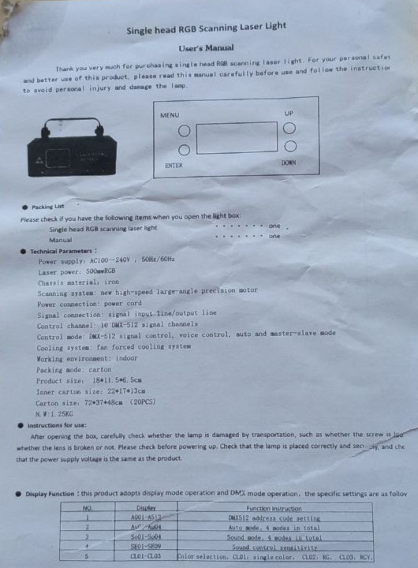
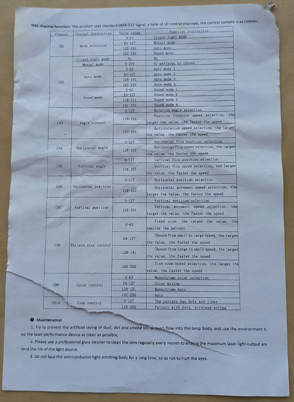
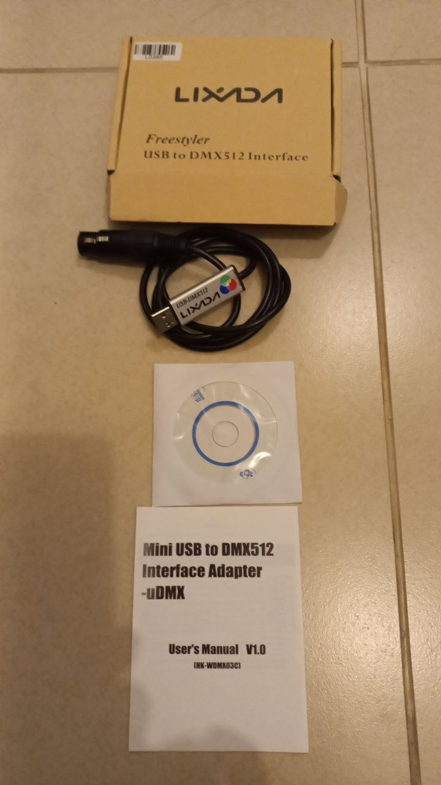

# DMX

## Documentation

### Scanned

This product adopts display mode operation and DMX mode operation,
the specific settings are as follows:

| NO |                              Display | Function Instruction                       |
|:--:|-------------------------------------:|--------------------------------------------|
| 1  |                            A001-A512 | DMX512 address code setting                |
| 2  |                            Au01-Au04 | Auto mode, 4 modes in total                |
| 3  |                            So01-So04 | Sound mode, 4 modes in total               |
| 4  |                            SE01-SE09 | Sound control sensitivity                  |
| 5  | CL01-CL03 CL01 CL02 CL03 | Color selection single color RG RGY |

DMX channel function: This product uses standard DMX-512 signal, 
a total of 10 control channels, the control content is as follows:

| Channel | Channel Instruction  |                                              Value range | Function Instruction                                                                                                               |
|:-------:|:--------------------:|---------------------------------------------------------:|:-----------------------------------------------------------------------------------------------------------------------------------|
|   CH1   |    Mode selection    |                0-63   64-127 128-191 192-255 | Closed light mode Manual mode Auto mode Sound mode                                                                     |
|   CH2   |  Closed light mode   |                                                       No | No                                                                                                                                 | 
|   CH2   |     Manual mode      |                                                    0-255 | 51 patterns to choose                                                                                                              |
|   CH2   |      Auto mode       |                  0-63 64-127 128-191 192-255 | Auto mode 1 Auto mode 2 Auto mode 3 Auto mode 4                                                                    |
|   CH2   |      Sound mode      |                  0-63 64-127 128-191 192-255 | Sound mode 1 Sound mode 2 Sound mode 3 Sound mode 4                                                                |
|   CH3   |    Angle control     |                            0-127 128-191 192-255 | Rotation angle selection Positive rotation speed selection, ** Anti-rotation speed selection, **                           |
|   CH4   |   Horizontal angle   |                                        0-127 128-255 | Horizontal flip position selection Horizontal flip speed selection, **                                                         |
|   CH5   |    Vertical angle    |                                        0-127 128-255 | Vertical flip position selection Vertical flip speed selection, **                                                             |
|   CH6   | Horizontal position  |                                        0-127 128-255 | Horizontal position selection Horizontal movement speed selection, **                                                          |
|   CH7   |  Vertical position   |                                        0-127 128-255 | Vertical position selection Vertical movement speed selection, **                                                              |
|   CH8   | Pattern size control |                  0-63 64-127 128-191 192-255 | Fixed size, ** Choose from small to large speed, ** Choose from large to small speed, ** Size zoom speed selection, ** |
|   CH9   |    Color control     |                  0-63 64-127 128-191 192-255 | Monochrome color selection Color mixing CMonochome Auto Auto                                                           |
|  CH10   |     Code control     |                                        0-127 128-255 | The pattern has dots and lines Pattern with dots, wireless strips                                                              |

** the larger the value, the faster the speed

**Maintenance:**

1. Try to prevent the artificial laying of dust, dirt and smoke oil or even flow into 
the lamp body, and use the environment to keep the laser performance device as clean as possible.
2. Please use a professional glass cleaner to clean the lens regularly every month to ensure
the maximum lase light output and extend the life of the light source.
3. Do not face the semiconductor light-emitting body for a long time, so as not to hurt eyes.

### Printed

## Cable
[The cable](https://www.lixada.com/p-l0385.html)

### Tutorials

[How to use QLC+](https://www.youtube.com/watch?v=41vtiM_T-qY)

## Lighting Control using DMX512 protocol on STM32

[This is an example](http://www.emcu.it/STM32/Lighting-Control-using-DMX512-protocol-on-STM32/Lighting-Control-using-DMX512-protocol-on-STM32.html)
of using DMX512 protocol on STM32.

The source code is not provided, but it is implemented by another developer.
* [The receiver](https://github.com/aleksandrgilfanov/stm32-dmx-receiver)
* [The transmitter](https://github.com/aleksandrgilfanov/stm32f4-dmx-transmitter)

