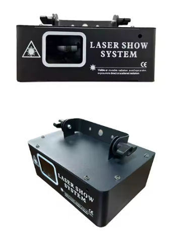
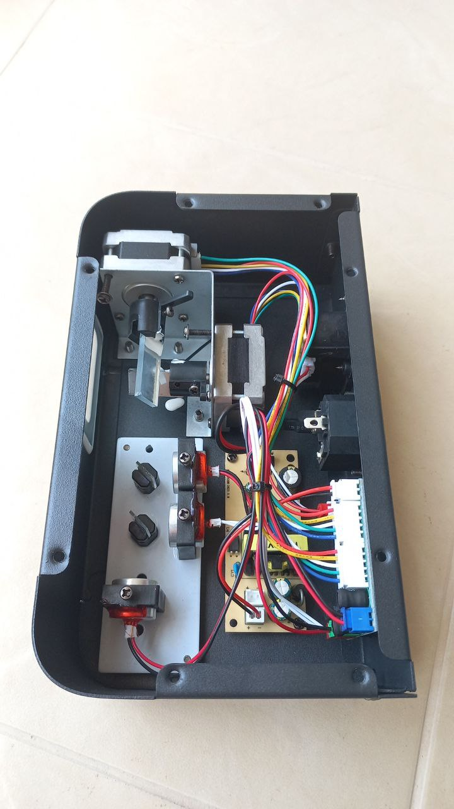
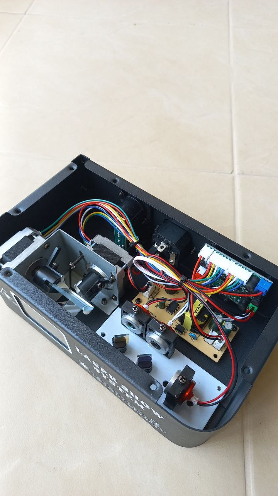
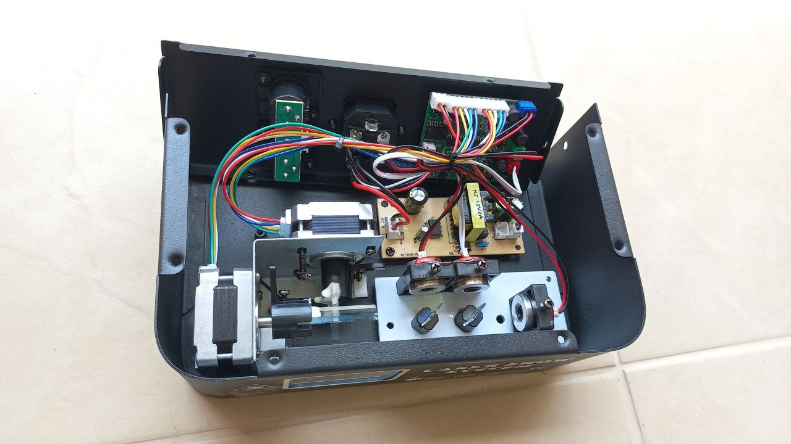
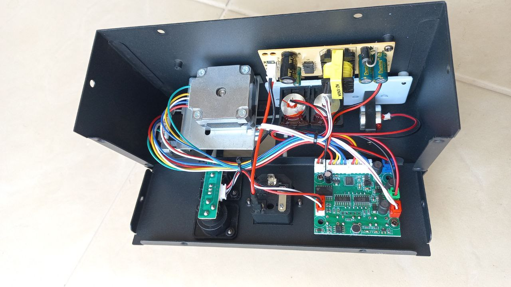
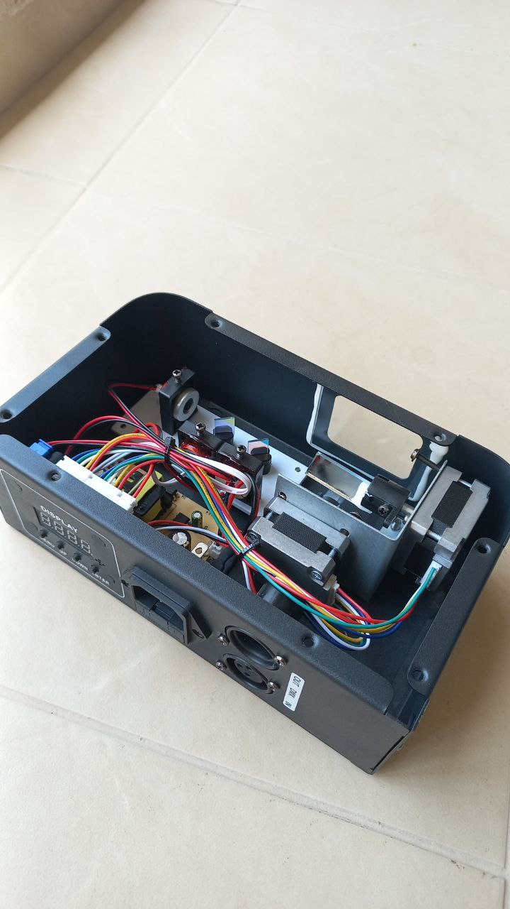
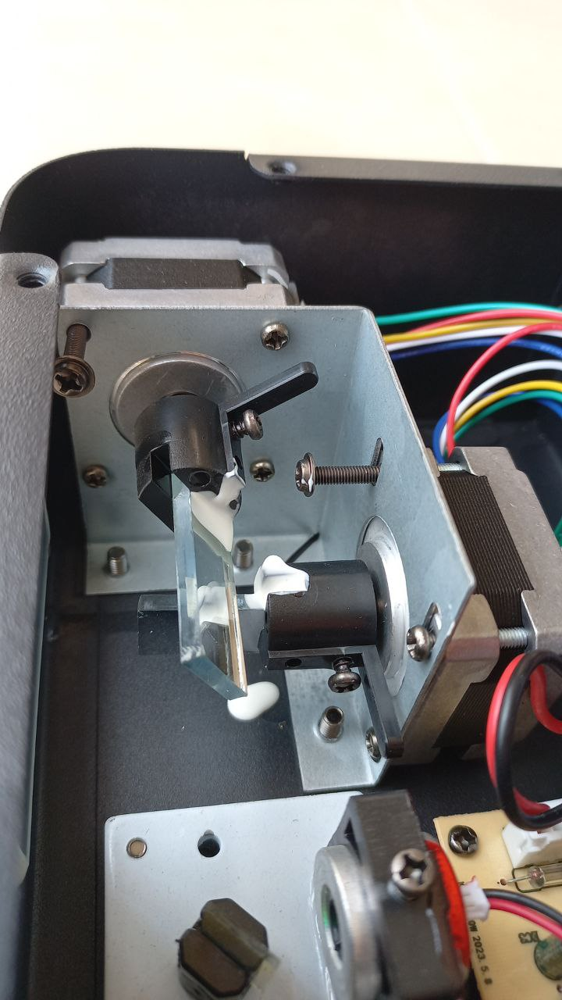
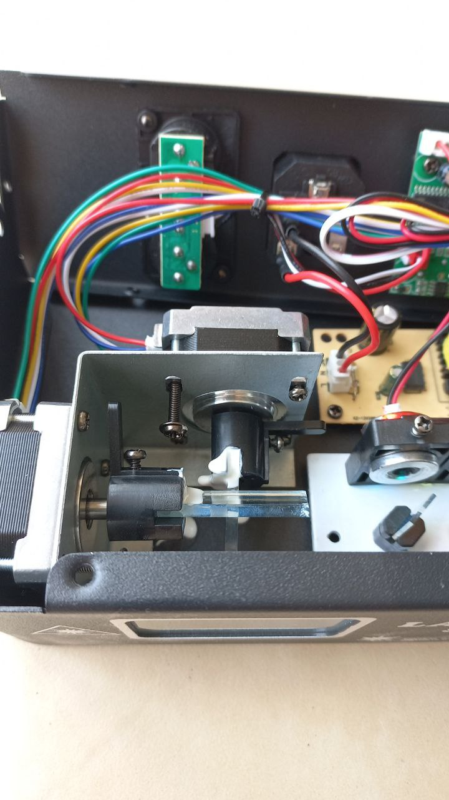

# Device
The goal of the project is to be able to drive this device from a computer.

A lot of similar devices can be [found on sale](https://de.aliexpress.com/w/wholesale-laser-show-system.html?spm=a2g0o.home.auto_suggest.2.269a7a8b2kO67i)

## TODO

1. implement hardware using STM32 blue pill
2. develop a protocol between the device and computer
3. implement the software to run on STM32

There is also [DMX interface](DMX.md), but I am not sure it works

## Hardware

### Motors

1. The device has two [unipolar step motors.](step-motors.md)

### Internals

[This is how](https://youtube.com/shorts/rjiIK6qfQHM?feature=share)
the device begins to work.

#### View

#### Mirrors

